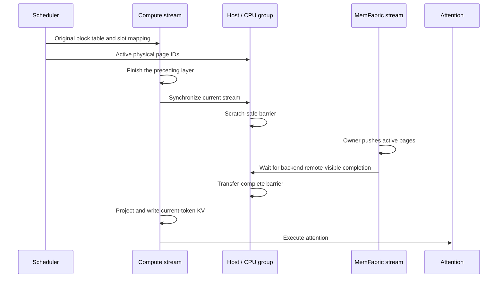

# KV Layer Parallelism

KV Layer Parallelism (KVPP) partitions persistent KV-cache ownership by
transformer layer. Each KVPP rank owns a contiguous bundle of layers and keeps
one reusable scratch cache for layers owned by another rank. Before attention
executes, the owner pushes only the physical KV pages used by the current batch
into the corresponding page IDs of each peer's scratch cache.

KVPP is not limited to decode. The same ownership and transfer rules apply to
prefill, decode, and mixed batches.

This document describes the configuration and cache planning in vLLM together
with the Ascend Model Runner V2 execution and active-page transport.

## Goals

KVPP is designed to:

- Reduce per-rank KV-cache memory by distributing persistent layer ownership.
- Reuse the existing TP/PCP rank layout without expanding the process world.
- Keep the scheduler's physical block-table and slot-mapping semantics intact.
- Transfer only pages that the current batch can read.
- Avoid whole-layer KV broadcasts and whole-layer staging allocations.
- Keep generic cache planning in vLLM and Ascend-specific transport in
  vLLM Ascend.

The baseline execution mode prioritizes correctness. Optional overlap modes
move the current or next layer's transfer earlier while preserving the same
scratch lifetime and completion contract.

## KVPP, DCP, and PP

KVPP reuses the rank-construction rule used by Decode Context Parallelism
(DCP), but it has different semantics.

| Property | DCP | KVPP |
| --- | --- | --- |
| Partition axis | Token sequence | Transformer layer |
| Persistent KV ownership | Sequence shard | Contiguous layer bundle |
| Process world expansion | No | No |
| Block-table behavior | Sequence-local layout | Original physical page IDs |
| Limited to decode | No | No |

The common `build_cp_overlay_groups` helper constructs both overlays, while
`dcp` and `kvpp` remain separate `GroupCoordinator` instances with independent
names and lifetimes. DCP and KVPP cannot both have a world size greater than
one. This prevents the KV cache from being partitioned along both layer and
sequence dimensions by independent paths.

KVPP's contiguous layer assignment resembles Pipeline Parallelism (PP), but
KVPP does not pipeline activations and does not divide model execution. Every
rank still executes every layer. The current Ascend implementation rejects
KVPP combined with PP.

## Configuration and process groups

KVPP is configured with:

```text
--kvpp-size <N>
```

The value is stored in `ParallelConfig.kvpp_size`. Without PCP, the TP size
must be divisible by the KVPP size:

```text
tensor_parallel_size % kvpp_size == 0
```

The model-parallel initialization API accepts
`kvpp_model_parallel_size`, creates the `kvpp` group, and exposes it through
`get_kvpp_group()`. The group is destroyed independently by
`destroy_model_parallel()`.

The generic vLLM rank layout allows a KVPP group to be disabled, span the PCP
axis, or span the complete TP x PCP block. PCP plus KVPP is not enabled in the
initial vLLM Ascend implementation.

## Layer ownership

The vLLM cache planner extracts the layer index from each logical cache name
and groups cache entries with the same index into one layer bundle. Bundles are
sorted by layer index and divided into contiguous partitions. If the layer
count is not divisible by the KVPP size, lower ranks receive one additional
bundle.

For eight layers and `kvpp_size=2`, the ownership is:

```text
rank 0: layers 0-3
rank 1: layers 4-7
```

It is deliberately not interleaved. Contiguous ownership reduces owner
switches during forward execution and provides a natural basis for future
next-layer prefetching.

The planner stores the result in `KVCacheConfig`:

```python
kvpp_rank: int
kvpp_layer_owners: dict[str, int] | None
```

The number of layer bundles must be at least the KVPP world size.

## KV-cache allocation

Each rank physically allocates:

- Persistent caches for all layers owned by that rank.
- One shared scratch cache for all non-owned layers in each KV-cache group.

The logical names of non-owned layers are expanded into the scratch tensor's
`shared_by` list. Consequently, the existing cache binding mechanism presents
the same scratch storage to every non-owned layer without changing the model's
logical layer names.

All non-owned layers sharing a scratch cache must have identical cache specs.
The planner rejects a group containing incompatible shapes, dtypes, or cache
layouts. The initial Ascend implementation further requires exactly one
KV-cache group and a non-hybrid MLA model.

For `L` uniform layers and a KVPP world size `K`, a rank uses approximately:

```text
L / K persistent layer caches + 1 scratch layer cache
```

The final block count is reduced to the minimum block count calculated for any
worker so that all ranks expose the same physical page address space.

## Metadata invariants

KVPP preserves the scheduler's original physical block table and slot mapping.
The batch metadata order is:

1. Gather the original block table.
2. Derive the batch's active physical pages from the CPU block-table mirror.
3. Pass the original device block table to attention.
4. Compute slot mapping from the original table and positions.
5. Pass the original slot mapping to the cache-write operators.

The initial implementation therefore has identity views:

```python
block_table_view(default) is default
slot_mapping_view(physical) is physical
```

An owner page with physical ID `P` is written directly to page `P` of each
peer's scratch cache. There is no compact block table, page renumbering, or
KVPP-specific slot-mapping rewrite. This keeps model-specific slot-mapping
logic isolated from KVPP.

## Active-page selection

MemFabric requires host-side address descriptors. To avoid a device-to-host
synchronization, KVPP derives active pages from the scheduler's CPU block-table
mirror.

For every request:

```text
pages_in_request = ceil(sequence_length / block_size)
```

Only block-table entries covered by this range are selected. Invalid page IDs
are discarded, and the remaining IDs are deduplicated and sorted. Transfers
therefore exclude unreferenced capacity and do not copy an entire cache layer.

## Transport boundary

`KVPPContext` owns layer scheduling, active-page selection, scratch lifetime,
and cross-rank synchronization. It selects a data-plane backend with:

```bash
export ASCEND_KVPP_TRANSPORT=sdma  # or mte when that backend is installed
```

Every backend consumes the same `KVPPPageTransferBatch` physical-page
descriptors and implements initialization, active-page push, completion, and
close operations. A completion cannot report success until its writes are
visible at every remote destination. This prevents the scheduler from assuming
that submission itself implies completion and allows a future MTE backend to
use remote flags instead of SDMA events.

Backend-specific peer addresses are not exposed to `KVPPContext`: SDMA metadata
contains registered peer virtual addresses, while an MTE backend will publish
symmetric or imported GVAs.

## MemFabric SDMA transport

`MemFabricSDMAKVPPTransport` is implemented independently of
`MooncakeLayerwiseConnector`. It reuses the layer-wise address-registration
idea without coupling KVPP's lifetime or ownership model to a connector class.

### Engine roles

Every KVPP rank is both a source for owned layers and a destination for
non-owned layers. MemFabric Hybrid 1.2 exposes role-specific Python bindings,
so production creates two engines per rank:

```text
source_engine: Prefill session
read_engine:   Decode session
```

These role names are MemFabric session roles and do not restrict KVPP to a
particular inference phase. The Decode session is the published destination of
owner-initiated writes.

Before vLLM starts, the MemFabric environment must be loaded and a store URL
must be configured:

```bash
source /usr/local/memfabric_hybrid/set_env.sh
export ASCEND_MF_STORE_URL=<store-url>
export ASCEND_MF_TRANSFER_PROTOCOL=sdma
```

The initial stream-submit implementation supports SDMA only.

### Registration and metadata exchange

For every cache tensor, KVPP records:

```python
KVPPBufferMetadata(
    base_addr,
    block_stride_bytes,
    block_bytes,
)
```

Registration ranges are grouped by underlying storage. Overlapping ranges and
ranges separated by no more than 4096 bytes are merged, preventing aliased
scratch views from being registered repeatedly.

After registration, ranks exchange the following metadata through the KVPP CPU
group:

- Source session ID.
- Destination session ID.
- Per-layer tensor base addresses.
- Logical block strides and payload sizes.

### Owner push

Only the owner of the current layer submits data movement. The preferred API
is:

```python
batch_transfer_async_write_submit(
    destination_session_id,
    source_addrs,
    destination_addrs,
    lengths,
    raw_stream,
)
```

If the batch API is unavailable, the transport falls back to individual
`transfer_async_write_submit` calls.

Adjacent physical pages are coalesced into one descriptor only when both the
source and destination have no padding between logical blocks. Padded layouts
retain one descriptor per page so the transfer cannot overwrite unrelated
bytes.

## Execution flow

The batch and layer execution flow is:



At the start of a layer, every rank first finishes consuming the scratch cache
from the preceding layer. The owner then pushes the active historical pages on
a dedicated communication stream. Current-token KV writes and attention wait
until remote page writes have completed.

All ranks compute the current token's KV values. On the owner, those writes
land in the layer's persistent cache. On non-owners, they land in the shared
scratch cache and may be overwritten after the layer completes. Thus only the
owner retains the layer's long-term KV state.

## Correctness invariants

The implementation maintains the following invariants:

1. Every logical layer has exactly one KVPP owner.
2. Only the owner's cache is persistent state for that layer.
3. A non-owner scratch cache is valid only for the current layer execution.
4. A scratch cache cannot be overwritten until all ranks finish the preceding
   layer's attention.
5. Current-token KV writes cannot race with the owner's historical-page push.
6. Owner and destination use the same physical page ID.
7. Only pages referenced by the current batch are transferred.
8. KVPP does not change scheduler block allocation or slot-mapping semantics.

## Supported configuration

The initial vLLM Ascend implementation requires:

| Capability | Requirement |
| --- | --- |
| Model runner | Ascend Model Runner V2 |
| Attention | Non-hybrid MLA |
| KV-cache groups | Exactly one |
| Execution mode | Eager |
| Pipeline parallelism | Disabled |
| PCP | Disabled |
| DCP | Disabled when KVPP is enabled |
| Speculative decoding | Disabled |
| KV connectors and offload | Disabled |
| MemFabric protocol | SDMA |

Unsupported combinations fail during configuration or cache initialization
rather than silently selecting a different cache layout.

## Correctness-first synchronization

The committed implementation uses two CPU-group rendezvous per transferred
layer:

1. Synchronize the current compute stream and enter a barrier before the owner
   overwrites shared scratch.
2. The owner records and synchronizes a MemFabric completion event, then all
   ranks enter a second barrier before current-token cache writes.

This establishes a simple correctness baseline, but it largely serializes
communication and computation. It is not the intended final performance path.

Future work can replace the global host barriers with per-layer scratch-ready
and transfer-complete notifications, and can initiate the next layer's push
after the preceding attention has stopped consuming scratch. Such work must
preserve the physical-page and owner-only persistence invariants described
above.

## Validation coverage

The commits add tests for:

- KVPP and DCP mutual exclusion.
- KVPP overlay-group construction.
- Contiguous layer ownership.
- Owned caches plus one shared scratch allocation.
- Rejection of incompatible scratch specs.
- CPU block-table access.
- Active-page filtering, deduplication, and ordering.
- Coalesced and padded transfer descriptors.
- Owner writes to original physical page IDs.
- Identity block-table and slot-mapping views.

The initial end-to-end validation target is a non-hybrid MLA model with
`TP=2`, `KVPP=2`, and eager execution. Additional feature combinations should
be enabled only after exact output comparison against `KVPP=1`.

## Related files

vLLM:

- Configuration: `vllm/config/parallel.py`
- KVPP process group: `vllm/distributed/parallel_state.py`
- Cache planning: `vllm/v1/core/kv_cache_utils.py`
- Cache configuration schema: `vllm/v1/kv_cache_interface.py`
- CPU block-table mirror: `vllm/v1/worker/gpu/block_table.py`

vLLM Ascend:

- Feature validation: `vllm_ascend/platform.py`
- Model Runner V2 integration: `vllm_ascend/worker/v2/model_runner.py`
- KVPP batch and layer lifecycle: `vllm_ascend/worker/v2/kvpp.py`
- MemFabric transport:
  `vllm_ascend/distributed/kv_transfer/kv_pool/memfabric_transport.py`
- MLA attention integration: `vllm_ascend/attention/mla_v1.py`
